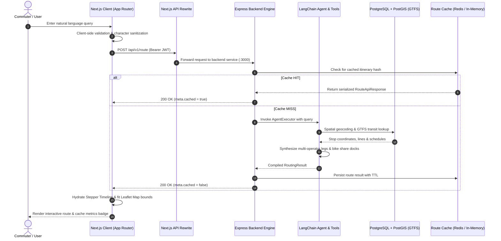

# Multimodal Routing Web

> A modern, high-performance Next.js client interface for autonomous natural language transit routing across complex multi-operator transportation networks.

[](https://nextjs.org/)
[](https://react.dev/)
[](https://www.typescriptlang.org/)
[](https://tailwindcss.com/)
[](https://leafletjs.com/)

This repository is the dedicated companion web application for the autonomous multi-agent backend engine:
🔗 **Backend Repository**: [`natural-language-to-multimodal-routing-agent`](https://github.com/daffarivaldi06/natural-language-to-multimodal-routing-agent)

---

## Table of Contents

- [Overview](#overview)
- [Architecture & Inter-Repository Integration](#architecture--inter-repository-integration)
- [API Contracts](#api-contracts)
- [Tech Stack](#tech-stack)
- [Key Features](#key-features)
- [Getting Started & Local Setup](#getting-started--local-setup)
- [Production & SSR Engineering Notes](#production--ssr-engineering-notes)
- [Project Structure](#project-structure)
- [License](#license)

---

## Overview

**Multimodal Routing Web** translates conversational commuter intent into structured, interactive transit itineraries. Designed specifically to pair with our autonomous LangChain and PostGIS backend agent, this client application provides:

- Zero-friction natural language transit queries (e.g., *"How do I get from Lille Flandres to Valenciennes University before 9 AM using tram or train?"*).
- Real-time reasoning indicators detailing agent execution steps (geocoding, spatial indexing, multi-operator route synthesis).
- Granular, multi-modal leg breakdowns with real-time transit telemetry, operator designations, and intermediate transfer stops.
- Dynamic geospatial visualization using hardware-accelerated dark map tiles and custom polyline rendering.

---

## Architecture & Inter-Repository Integration

The client interface acts as the presentation and orchestration consumption layer, communicating with the backend engine via a secured REST API (`/api/v1/*`).

### System Flow Diagram



---

## API Contracts

The frontend expects the backend service to implement the following schema for authenticated route planning.

### Endpoint: `POST /api/v1/route`

#### Request Headers
```http
Content-Type: application/json
Authorization: Bearer <jwt_access_token>
```

#### Request Payload
```json
{
  "query": "Find me the fastest route from Lille Flandres to Valenciennes University mixing train and bus"
}
```

#### Response Payload (`200 OK`)
```json
{
  "success": true,
  "query": "Find me the fastest route from Lille Flandres to Valenciennes University mixing train and bus",
  "result": {
    "origin": "Lille Flandres",
    "destination": "Valenciennes University",
    "legs": [
      {
        "mode": "train",
        "from": "Gare de Lille Flandres",
        "to": "Gare de Valenciennes",
        "line": "TER 842100",
        "operator": "SNCF",
        "durationSeconds": 2400,
        "distanceMeters": 52000,
        "originCoords": {
          "lat": 50.6365,
          "lng": 3.0700
        },
        "destinationCoords": {
          "lat": 50.3585,
          "lng": 3.5235
        }
      },
      {
        "mode": "tram",
        "from": "Valenciennes Gare",
        "to": "Université Mont Houy",
        "line": "T1",
        "operator": "Transvilles",
        "durationSeconds": 720,
        "distanceMeters": 4200,
        "originCoords": {
          "lat": 50.3585,
          "lng": 3.5235
        },
        "destinationCoords": {
          "lat": 50.3238,
          "lng": 3.5134
        }
      }
    ],
    "bikeOptions": [
      {
        "id": "dock-102",
        "name": "Station Université Campus",
        "availableBikes": 7,
        "totalSlots": 14,
        "provider": "Transvilles Vélos",
        "distanceMeters": 180
      }
    ],
    "totalEstimatedDurationSeconds": 3120,
    "totalDistanceMeters": 56200,
    "cachedAt": "2026-09-24T14:30:00.000Z",
    "agentThought": "Identified direct regional express line TER followed by tramway line T1 to minimize walking transfers."
  },
  "meta": {
    "cached": false,
    "model": "gpt-4o",
    "timestamp": "2026-09-24T14:30:00.000Z"
  }
}
```

---

## Tech Stack

| Layer | Technology | Purpose |
| :--- | :--- | :--- |
| **Framework** | [Next.js](https://nextjs.org/) (v16 App Router) | Hybrid static/client-side routing, Webpack bundler, rewrite proxying |
| **Language** | [TypeScript](https://www.typescriptlang.org/) (Strict Mode) | End-to-end interface safety matching backend entities |
| **Styling** | [Tailwind CSS](https://tailwindcss.com/) (v4) | Dark-mode native, ultra-lean utility stylesheets |
| **UI Components** | [shadcn/ui](https://ui.shadcn.com/) / Radix UI | Accessible primitives (Dialogs, Separators, Badges, Labels) |
| **Iconography** | [Lucide React](https://lucide.dev/) | Consistent iconography for transit modes and navigation controls |
| **Mapping** | [Leaflet](https://leafletjs.com/) & [React Leaflet](https://react-leaflet.js.org/) | Geospatial vector layers, polyline rendering, and custom DOM markers |
| **Animations** | [Framer Motion](https://www.framer.com/motion/) | Micro-interactions, timeline cascades, and status transitions |
| **Feedback** | [Sonner](https://sonner.emilkowal.ski/) | Non-blocking toast notifications for network/auth events |

---

## Key Features

### 1. Conversational Query Input
- Clean input field with dynamic submit controls, submission shortcuts (`Enter`), and quick-start query chips.
- Real-time character counter and input validation to optimize token usage before dispatching to the LLM.

### 2. Multi-Operator Stepper Timeline
- Visualizes discrete route segments with color-coded badges for **Walk**, **Bike**, **Bus**, **Metro**, **Tram**, and **Train**.
- Displays transport line identifiers (e.g., `TER`, `M2`, `Line 14`), transit operator logos/names, duration, and metric distance.
- Integrated last-mile bike-share module showing real-time dock availability and provider info.

### 3. "Agent Reasoning" Dynamic Terminal Loader
- An animated inspection terminal that tracks the agent's progress across distinct lifecycle stages:
  - Natural language parsing & entity extraction
  - Spatial geocoding (`PostGIS ST_MakePoint`)
  - GTFS schedule and stop graph queries
  - Multi-operator route synthesis via LangChain
  - Cache persistence & payload finalization

### 4. Hardware-Accelerated Interactive Map
- Automatic camera fitting and dynamic zoom bound calculations (`fitBounds`) encompassing all route waypoints.
- Distinct color-coded polylines matching individual transport modes (solid lines for transit, dashed for walking paths).
- High-contrast custom HTML marker pins for Departure, Arrival, Transfer Points, and Bike Share Hubs.

### 5. Cache & LLM Telemetry Header
- Visual telemetry badge indicating real-time status:
  - `CACHE: HIT` (served from Redis/in-memory cache) vs `CACHE: MISS` (freshly synthesized by agent).
  - Active LLM model descriptor (e.g., `gpt-4o`, `claude-3-5-sonnet`).

---

## Getting Started & Local Setup

### Prerequisites

1. **Node.js**: `v20.x` or higher installed.
2. **Backend Engine**: A running instance of [`natural-language-to-multimodal-routing-agent`](https://github.com/daffarivaldi06/natural-language-to-multimodal-routing-agent) (typically on `http://localhost:3000`).

### 1. Clone & Install Dependencies

```bash
# Clone the frontend repository
git clone https://github.com/daffarivaldi06/multimodal-routing-web.git
cd multimodal-routing-web

# Install packages
npm install
```

### 2. Configure Environment Variables

Create a `.env.local` file in the root of the project:

```bash
cp .env.example .env.local 2>/dev/null || touch .env.local
```

Populate `.env.local` with the backend URL:

```env
# Backend Service URL (Default Express port: 3000)
NEXT_PUBLIC_API_URL=http://localhost:3000
```

> **Note on Rewrites**: In development and browser environments, API calls are directed to `/api/*` and proxied by Next.js rewrites defined in `next.config.ts` to prevent CORS issues.

### 3. Run Development Server

```bash
npm run dev
```

The application will start on **`http://localhost:3001`** (configured to avoid port collisions with the backend on port 3000).

### 4. Build for Production

```bash
# Compile and optimize production bundle
npm run build

# Start production server
npm run start
```

---

## Production & SSR Engineering Notes

### Leaflet Map Hydration & SSR Bypassing

Leaflet directly interacts with the browser's global `window` and `document` APIs immediately upon module execution. Running Leaflet in a standard Server-Side Rendering (SSR) pipeline causes fatal execution errors (`window is not defined`).

To guarantee hydration safety and performance, the Leaflet map component is decoupled into an isolated client chunk and consumed via `next/dynamic` with SSR explicitly disabled:

```tsx
// src/components/layout/MapPanel.tsx
import dynamic from "next/dynamic";

const LeafletMap = dynamic(
  () => import("./LeafletMap"),
  {
    ssr: false,
    loading: () => <StaticMapPlaceholder />,
  }
);
```

#### Leaflet Asset Hashing Fix
Default marker icon asset paths can break when packaged with Webpack/Next.js asset hashing. A custom fix is injected within `LeafletMap.tsx`:

```ts
delete (L.Icon.Default.prototype as unknown as Record<string, unknown>)._getIconUrl;
L.Icon.Default.mergeOptions({
  iconRetinaUrl: "https://cdnjs.cloudflare.com/ajax/libs/leaflet/1.9.4/images/marker-icon-2x.png",
  iconUrl: "https://cdnjs.cloudflare.com/ajax/libs/leaflet/1.9.4/images/marker-icon.png",
  shadowUrl: "https://cdnjs.cloudflare.com/ajax/libs/leaflet/1.9.4/images/marker-shadow.png",
});
```

---

## Project Structure

```text
frontend/
├── src/
│   ├── app/                    # Next.js App Router root
│   │   ├── dashboard/          # Authenticated route-planning dashboard
│   │   ├── login/              # Authentication login view
│   │   ├── register/           # Commuter registration view
│   │   ├── globals.css         # Tailwind CSS v4 styling & dark theme tokens
│   │   ├── layout.tsx          # Root HTML layout with providers
│   │   └── page.tsx            # Landing & redirect logic
│   ├── components/
│   │   ├── auth/               # Login & Register form cards
│   │   ├── layout/             # Navbar, Sidebar, MapPanel, and LeafletMap
│   │   ├── route/              # QueryInput, LegCard, RouteTimeline, BikeStationList
│   │   ├── shared/             # CacheBadge, LoadingSkeleton, ModeIcon
│   │   └── ui/                 # Accessible primitives (button, badge, card, etc.)
│   ├── hooks/                  # Custom hooks (useAuth, useRoute)
│   ├── lib/                    # API client, auth utilities, and class mergers
│   ├── providers/              # React Context providers (AuthProvider)
│   └── types/                  # TypeScript interface contracts for API payloads
├── public/                     # Static media and icons
├── next.config.ts              # API proxy rewrites and CSS chunking config
├── package.json                # Dependencies and dev scripts
├── tsconfig.json               # Strict TypeScript configuration
└── README.md                   # Repository documentation
```

---

## License

This project is open-source under the [MIT License](LICENSE).
